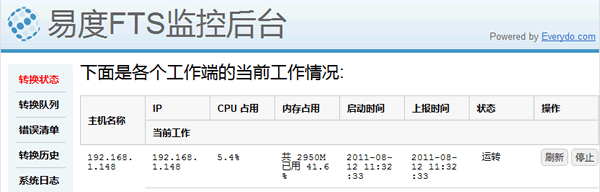
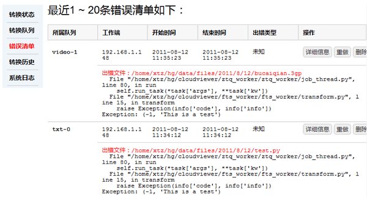

产品介绍
/////////////////////////////////////

.. contents::
	:class: sidebar affix
	
传统网站，文档必须下载才能查看，这带来很多困扰：

- 用户可能仅仅想知道这个文件是什么，但是需要经过漫长的下载等待，这个十分不友好
- 完整下载，导致占用过多的带宽
- 用户可能没有安装相关的文档查看软件，特别是在移动设备上
- 特别是对于常用的压缩包中的文件，查看更是不方便

文档在线查看，这个是互联网对文档分享的又一新需求。这涉及服务端的文档格式转换，以及浏览器端的文档查看体验2部分。

如何更快、更稳定的对更多格式的文档进行转换，在更多的终端设备上做到不失真查看，
成为众多服务提供商的共同难题。

易度云查看，是易度在若干年企业文档管理开发经验上最新开发的一款产品，提供了文档转换和查看的一揽子解决方案，让服务提供商在自己的应用中轻松实现文档查看和预览的功能。

百种文件支持，强劲转换
===============================

支持转换的文件格式
---------------------------

文档

- Office2003/2007：doc/docx、xls/xlsx、pptt/pptx、pps、pot
- WPS2009：wps、et、dps
- OpenOffice：odt、ods、odp、ott、ots、otp
- PDF: pdf
- 文本文件：txt、html、rst、mht
- 代码文件：.java、.c、.cpp、.jsp、.asp、.py、.as、.h

图

- 图片：bmp、jpg、png、gif、tiff
- 图纸：dwg

流媒体

- 音频：mp3、wma、rm、wav、mid
- 视频：avi、rmvb、mov、mp4、swf、flv、mpg、ram

压缩包

- rar、zip、tar、tgz

按需转换，随转随看
---------------------------

按需转换：仅在用户第一次查看时进行转换文档，且系统进行缓存，供以后续查看用户进行查看。

边转边看：系统一边转换，用户就可以一边查看，速度快，而不需要全部转换完成才能查看。

支持压缩包转换
---------------------------
许多转换系统都对压缩包无法处理，易度云查看产品深入压缩文件细节，可以对压缩文件进行自动解压，提取文件信息，并进行转换，方便用户查看压缩包文件细节，按需提取自己想要的文件。

8 种查看方式，跨终端浏览
===============================

易度云查看支持以下 8 种查看方式：

- Flash 文档查看器（swfx） (大小仅37K)
- 纯文本查看器
- HTML/HTML5 查看器
- PDF 下载查看
- 查看缩略图
- 图片查看器
- 流媒体查看器
- 压缩包查看器

浏览器、手机等多终端支持
----------------------------------------
办公场景的多样化，移动办公的需求越来越强烈，易度云查看引擎把各类文档转成浏览器和手机支持的阅读格式，使用便捷。

缩略图式查看
----------------------------------------
我们为各类文档以及音视频提供缩略图，这样用户就很方便地查看文档或其他文件的摘要信息。

流式查看，快，且节约流量
----------------------------------------
用户有时并不会阅读全文，而只浏览前几页来决定是否继续查看。
如果一次性全部加载对服务器压力、带宽都造成损失。流式查看，每次仅加载用户所需要的，节约流量，而且最重要的是用户的速度快。
同时，对小带宽的手机用户更方便，又快又节约流量。

系统运维
=================
系统提供专门的运维后台，帮助更好的管理系统。运维后台提供如下功能：

拥塞处理
-----------------

- 查看队列拥塞情况
- 调整转换调度策略

  - 工作机器处理负荷调度
  - 队列处理优先级调度

系统故障处理
-----------------

- 服务器运行状态
- 转换异常监视
- 转换异常解决：放弃/重做

下面是几个后台截图：

（图1 工作端状态）

（图2 队列拥塞情况）

（图3 错误监视处理）

