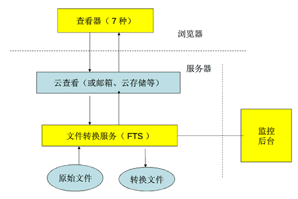
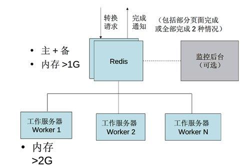
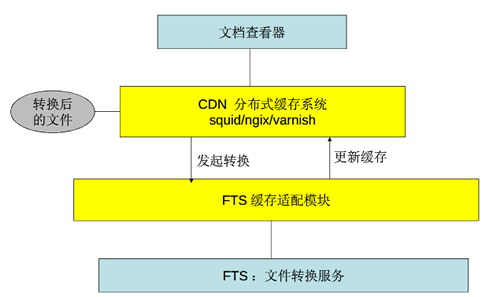

技术文档
//////////////////

.. contents::

系统总体组成
==============

总体组成图如下：

其中:

1. 查看器包括8种，在浏览器上运行。如需定制，可以使用我们提供的flash控件，以及相关的js代码。
2. 云查看模块，可以是我们标准的产品，也可以是集成了转换服务接口的系统。这里可能需要限定文档的访问权限。
3. 文档转换服务，是底层进行文档后台转换的一个服务。
4. 监控后台，用于监控文档转换服务，确保系统稳定可靠运行。

云查看API
===================
云查看有2种集成API，都是js的api，在浏览器中实现集成，非常简单。

下载链接云查看
---------------------

如果希望让您的站点快速支持下载文件的在线查看，在部署云查看标准版后，只需在您的网站加入如下代码即可::

    
    

添加后，您的站点中的下载链接，会自动转换为云查看链接，从而实现文档的云查看。

网页内嵌云查看
---------------------
在您的网页中内嵌一个查看器，方法为::

    

    
    

其中edo_view方法是关键，有5个参数:

- ``http://your.server.ip:port`` :这个是服务器的地址和端口, 比如 ``http://viewer.everydo.com:9870/``
- ``file:///var/aa.doc`` 表示原始文件的url地址， ``file://`` 表示是本地文件，也可以是 ``http://``, ``ftp://`` 等远程获取.
- ``doc-viewer`` : 查看器放置位置的id
- ``700, 700`` : 初始大小

我们会根据文件的后缀以及浏览器支持的情况，进行自动选择合适的查看器：

- 在支持flash的浏览器上，我们会采用flash查看器来显示doc/ppt/pdf之类的文件
- 对excel文件，我们会采用html来查看
- 对于不支持flash的浏览器，我们会采用html来显示

安装环境
==================
- Ubuntu Server 8.04 以上版本

Windows版本可能在未来发布

FTS文档转换服务
======================
FTS文档转换服务，是系统核心的转换服务，内部构成如下：

可以看到：

1. FTS文档转换服务，是以Redis作为中心的数据库，也是和外部通信的接口。
2. 监控后台是可选启动的服务
3. 工作服务器可部署多台，按需平滑扩展，自动负载均衡

CDN 缓存部署
==================
转换后的数据通常比原始的文件数量还要多。

转换文件的存储管理，以及高可用部署，成为一个难点。

对于数据量不大的小型系统，普通存储即可满足要求。

对于大数据量高可用的服务，易度云查看推荐使用CDN/缓存管理来管理转换后的数据，技术架构图如下：

主要特点：

- 使用现有技术： Squid/apache/nginx/varnish
- 使用现有的管理知识
- 标准的整合方法
- 海量数据省空间、自动删除少用数据
- 大负载：方便扩容和负载均衡
- 容错：对磁盘要求低，廉价存储系统即可

转换API
================

转换API是更加底层的API，可直接发起文件转换请求。普通的用户不需要这个接口，仅仅对于那些需要深入定制的需要掌握。

系统采用Redis转换接口，包括2个转换队列：

- （输入）转换请求队列 fts:queue:raw
- （输出）完成通知队列 fts:queue:transformed

这2个队列的任务是json格式， 队列内容完全相似。

转换请求队列
-----------------------
如果只希望进行一种转换，可在这个队列中加入如下json格式的内容::

    {
    "origin": "/opt/hg/data/files/input.pdf",
    "origin_mime": "application/pdf",
    "result_mime": "application/x-shockwave-flash-x",
    "result": "/opt/hg/data/frscache/.frs.flash-x/transformed.swf",
    "page": 0
    }

其中：

- origin：待转换文件位置
- result: 转换后主文件存放位置他的附加文件，存放在同一文件夹
- origin_mime: (可选)待转换文件类型
- result_mime: (可选)转换后的文件类型
- page：页面分割号果是0表示整个文档，否则表示文件分段号

对于一次转多种格式（比如swf和txt），由于不同的转换，可能有相同的过渡文件。
为了加速转换过程，避免重复转换，可使用一次多转接口，json内容为::

    {'origin': '原文件绝对地址',
     'origin_mime'：'原文件的mime类型',
     'results': {
                    '转换结果文件1 mime类型':  '转换结果文件1 存放绝对地址',
                    '转换结果文件2 mime类型':  '转换结果文件2 存放绝对地址',
                },
    }

完成通知队列
-----------------
转换完成后，无论成功与否，都会通知发起方。对于单一转换，返回::

    {
    "origin": "/opt/hg/data/files/input.pdf",
    "origin_mime": "application/pdf",
    "result_mime": "application/x-shockwave-flash-x",
    "result": "/opt/hg/data/frscache/.frs.flash-x/transformed.swf",
    "page": 0,
    "return_code": 0,
    "return_msg": 'asdfasds'
    }

对于一次多转::

    {
    "origin": "/opt/hg/data/files/input.pdf",
    "origin_mime": "application/pdf",
     'results': {
                    '转换结果文件1 mime类型':  '转换结果文件1 存放绝对地址',
                    '转换结果文件2 mime类型':  '转换结果文件2 存放绝对地址',
                },
    "page": 0,
    "return_code": 0,
    "return_msg": 'asdfasds'
    }

参数和转换请求队列相似，补充了2个:

- return_code: 转换成功与否的代码

  - -9   程序被退出
  - -15  程序被杀死
  - 0    程序执行完成
  - 13   没有找到匹配的文件(通常是输入/源文件)
  - 65   程序没有安装    
  - 202  pdf 有版权保护
  - 300  未知错误

- return_msg: 转换额外信息，通常是错误提示

转换格式明细
=============================

office类文档
--------------------
包括：

Office2003/2007:

- doc (application/msword)
- docx (application/vnd.openxmlformats-officedocument.wordprocessingml.document)
- xls (application/vnd.ms-excel)
- xlsx (application/vnd.openxmlformats-officedocument.spreadsheetml.sheet)
- ppt、pps 、pot (application/vnd.ms-powerpoint)
- pptx (application/vnd.openxmlformats-officedocument.presentationml.presentation)
- rtf (application/rtf )

WPS2009:

- wps (application/kswps)
- et (application/kset)
- dps (application/ksdps )

openoffice:

- odt (application/vnd.oasis.opendocument.text)
- ods (application/vnd.oasis.opendocument.spreadsheet)
- odp (application/vnd.oasis.opendocument.presentation)
- ott (application/vnd.oasis.opendocument.text-template)
- ots (application/vnd.oasis.opendocument.spreadsheet-template)
- otp (application/vnd.oasis.opendocument.presentation-template)

Office文档可以使用如下查看方式：

- 文档flash查看： application/x-shockwave-flash-x
- 纯文本查看：text/plain
- html查看：text/html
- pdf查看： application/pdf
- 缩略图查看：image/png

  这个是我们系统自己定制的， 要缩略图就用这个mime类型

HTML
--------------
包括:

- mht(message/rfc822)
- html( text/html )

查看方式：

- HTML查看

  安全的html, 将javascript, object... 等危险的标签移除

- 纯文本查看
- 缩略图查看
- PDF查看

PDF
--------------
pdf 可以转换如下类型：

- HTML
- 纯文本
- FLASH
- 缩略图

纯文本
---------------
包括：

- txt ( text/plain )
- rst ( text/x-rst )
- xml ( text/xml )
- css ( text/css )
- csv ( text/csv )
- java ( text/x-java )
- c ( text/x-csrc )
- cpp ( text/x-c++src )
- jsp ( text/x-jsp )
- asp ( text/x-asp )
- py ( text/x-python )
- as ( text/x-as )
- sh ( text/x-sh )

纯文本 可以转换如下类型：

- HTML
- PDF

图
------
- 图片：

  - bmp (image/x-ms-bmp)
  - jpg、jpeg (image/jpeg)
  - png (image/png)
  - gif (image/gif)
  - tiff (image/tiff)
  - ppm (image/x-portable-pixmap)

- 矢量图纸：dwg (application/dwg)

图片可以转换如下类型：

- 缩略图预览

音频
----------------

- mp3 (audio/mpeg) * 可以直接预览 *
- wma (audio/x-ms-wma)
- rm (audio/x-pn-realaudio) * 可以直接预览*
- wav (audio/x-wav) * 可以直接预览*
- mid (audio/midi) * 可以直接预览*

音频可以转换如下类型：

- MP3 ( audio/x-mpeg )

视频
----------------

- avi (video/x-msvideo)
- rmvb (video/vnd.rn-realvideo)
- mov (video/quicktime)
- mp4 (video/mp4)
- swf (application/x-shockwave-flash)
- flv (video/x-flv) * 可以直接预览*
- mpg ( video/mpeg )
- ram (application/x-pn-realaudio)
- wmv (video/x-ms-wmv)
- m4v (video/m4v)

可采用如下查看方式

- 缩略图
- FLV (vide/x-flv)

压缩包
------

- rar ： application/rar
- zip： application/zip
- tar： application/tar application/x-tar
- tgz：application/x-gzip application/x-compressed

可转换为包含文件夹内容的 json格式： application/json

